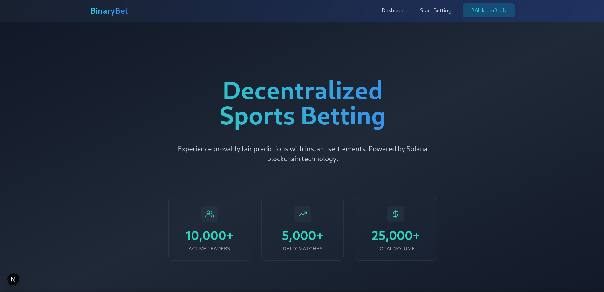

# 🚀 Decentralized Betting Platform [ Contract part Under Construction]



> Next-generation betting platform built on Solana blockchain

[](https://solana.com/)
[](https://nextjs.org/)

## 🌟 Features

- ⚡️ **Instant Settlements** powered by Solana blockchain
- 🔒 **Provably Fair** on-chain verifiable randomness
- 💰 **Low Fees** (2% platform fee on wins only)
- 📈 **Real-time Odds** calculation
- 📱 **Mobile-First** responsive design
- 📊 **Activity Tracking** with transaction history


## These implementations maintain consistent styling with:

- Gradient backgrounds
- Glass-morphism effects
- Framer Motion animations
- Responsive design
- Consistent icon usage
- Dark mode styling
- Proper component structure

## 🛠️ Tech Stack

- **Frontend**: Next.js, React, Tailwind CSS, Framer Motion
- **Blockchain**: Solana Web3.js, Phantom Wallet Integration
- **Styling**: Glass Morphism, Gradient Effects
- **Tools**: Vercel, ESLint, Prettier

## 🚀 Getting Started

1. Clone the repository:
```bash
git clone https://github.com/yourusername/decentralized-betting.git
```

🤝 Contributing
Contributions are welcome! Please follow these steps:

- Fork the project
- Create your feature branch (git checkout -b feature/AmazingFeature)
- Commit your changes (git commit -m 'Add some AmazingFeature')
- Push to the branch (git push origin feature/AmazingFeature)
- Open a Pull Request

